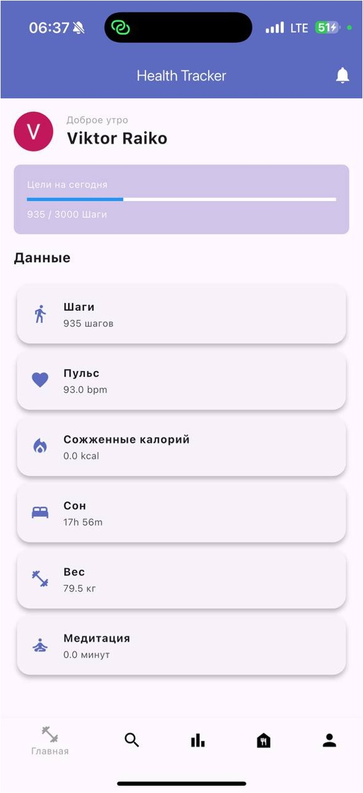
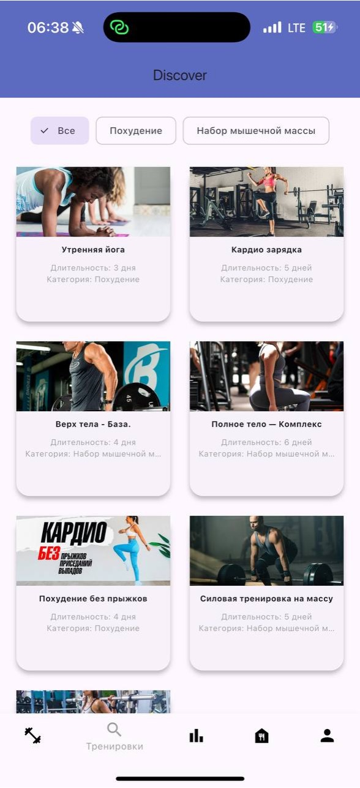
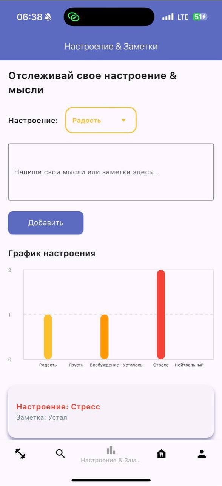
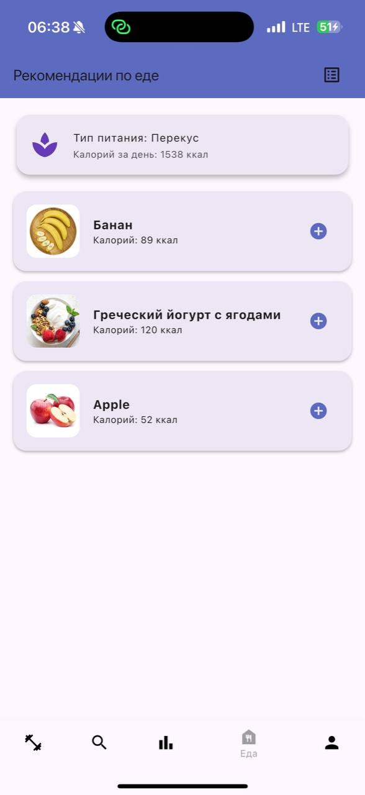
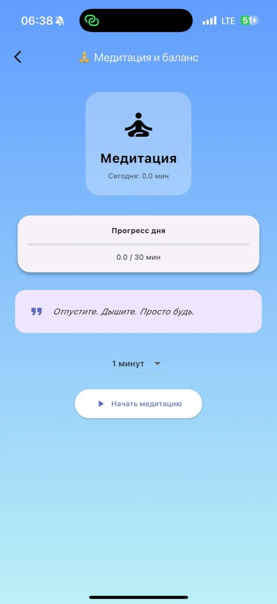

# �� HealthTracker App

[](https://flutter.dev/) [](https://firebase.google.com/)  

> **RU:** Приложение для отслеживания здоровья, сна, пульса и медитации — с поддержкой Apple Watch.
> 
> **EN:** Health, sleep, heart rate & meditation tracker app — with Apple Watch support.

---

## 📸 Скриншоты / Screenshots

<table>
  <tr>
    <td align="center">
      <a href="screenshots/main_menu.jpg"></a><br/>
      Главный экран<br/>Main menu
    </td>
    <td align="center">
      <a href="screenshots/training_menu.jpg"></a><br/>
      Тренировки<br/>Training
    </td>
    <td align="center">
      <a href="screenshots/mood_notes.jpg"></a><br/>
      Настроение и заметки<br/>Mood & Notes
    </td>
  </tr>
  <tr>
    <td align="center">
      <a href="screenshots/foot_menu.jpg"></a><br/>
      Питание<br/>Food
    </td>
    <td align="center">
      <a href="screenshots/foot_detail.jpg"></a><br/>
      Детали питания<br/>Food Detail
    </td>
    <td align="center">
      <a href="screenshots/meditation.jpg"></a><br/>
      Медитация<br/>Meditation
    </td>
  </tr>
</table>

---

## 🚀 Функциональность / Features

- 🔬 Измерение пульса в реальном времени через Apple Watch / Real-time heart rate via Apple Watch
- 💤 Отслеживание сна, шагов, калорий и активности / Sleep, steps, calories & activity tracking
- 🍽 Уведомления о приёме пищи и рекомендации по питанию / Meal reminders & nutrition tips
- 🧘 Медитации с дыхательной анимацией и таймером / Meditation with breathing animation & timer
- 🎯 Постановка целей (например, шагов в день) / Goal setting (e.g. daily steps)
- 🔔 Уведомления о достижении целей (геймификация) / Goal achievement notifications (gamification)
- 🛡 Система доверенного контакта (в экстренных ситуациях) / Trusted contact system (emergency)

---

## 🛠 Технологии / Tech Stack

- **Flutter** — UI-фреймворк для кроссплатформенного мобильного интерфейса
- **Dart** — основной язык программирования
- **Firebase** — аутентификация, Firestore, Storage, уведомления
- **HealthKit** — интеграция с Apple Watch (пульс, сон, активность)
- **Пакет `health`** — обёртка для взаимодействия с Apple HealthKit
- **Provider** — управление состоянием приложения
- **Visual Studio Code** — среда разработки

---

## 📦 Установка / Getting Started

1. **Клонируй репозиторий / Clone the repo:**

```bash
git clone https://github.com/25angel/health_tracker_app.git
cd health_tracker_app
```

2. **Установи зависимости / Install dependencies:**

```bash
flutter pub get
```

3. **Настрой Firebase / Configure Firebase:**
- Создай проект на [Firebase Console](https://console.firebase.google.com)
- Добавь Android- и iOS-приложения
- Скачай и помести:
  - `google-services.json` → `android/app/`
  - `GoogleService-Info.plist` → `ios/Runner/`

📌 Без этих файлов Firebase (аутентификация, база и storage) работать не будет.

4. **Запусти приложение / Run the app:**

```bash
flutter run
```

> Убедись, что подключено устройство или эмулятор. / Make sure a device or emulator is connected.

---

## 🎬 Demo

<!-- Optionally add a GIF or video link here -->
<!--  -->

---

## 🤝 Contributing

Pull requests are welcome! For major changes, please open an issue first to discuss what you would like to change.

---

## 📄 License

Проект защищён авторским свидетельством. Все права защищены.

---

## 👤 Author / Contacts

- Telegram: [@svnteenmart](https://t.me/svnteenmart)
- GitHub: [25angel](https://github.com/25angel)